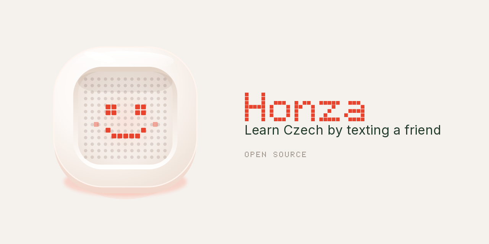
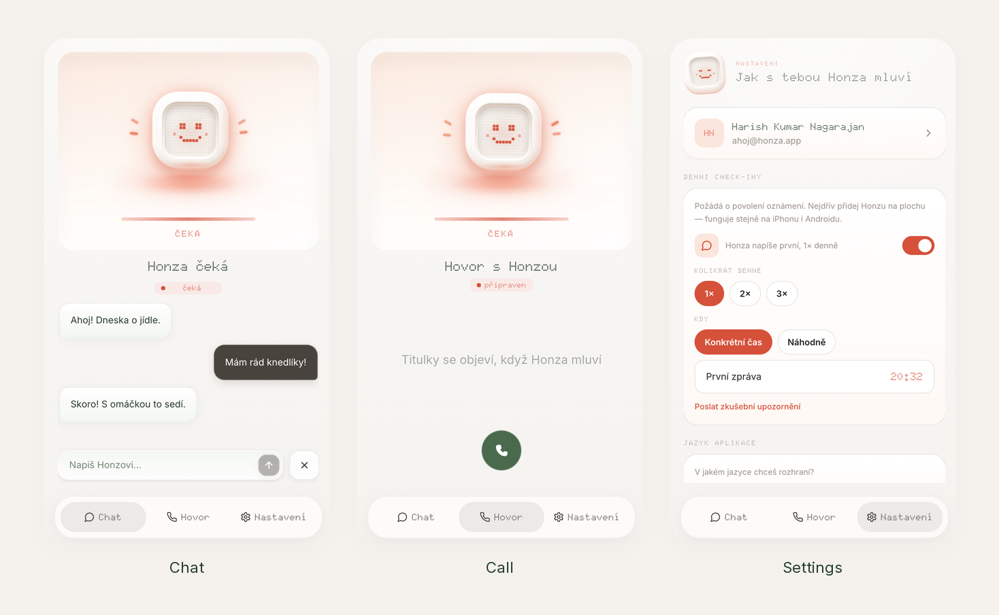

# Honza 🇨🇿

**Czech practice from the notes you and your teacher already share.**

You already have a teacher. After class, the lesson sits in a Google Doc the two of you share. The hard part is not finding more Czech. The hard part is still knowing it on Thursday.

Honza is that gap. He reads the notes you already have and brings a word or a grammar point back as a short conversation. You answer in Czech. He corrects you inside the same thread and keeps going. There is no second curriculum to start.

Saying it, fixing it, and hearing it is what makes the note stick. Turn notifications on and Honza starts the conversation for you, so the habit does not depend on you remembering to open the app.






[heyhonza.vercel.app](https://heyhonza.vercel.app) is a tour of the interface. It links here. To practice with Honza, you run the app yourself.

## ✨ What it does

### 💬 Chat

Honza opens in Czech. You type back. When a case or a word is off, the correction stays in the conversation, and the next sentence is already waiting.

### 📞 Call

You speak Czech. Honza speaks back. The whole exchange is saved with your chats, so a call is practice you can reread later.

### 🌿 Daily check-ins

Turn notifications on and Honza writes first. You do not keep a reminder list. He starts the conversation, and the notification brings you to it.

Once a day, twice a day, or three times a day. Pick the clock times yourself, or leave them random. Random means he reaches out somewhere between 8 in the morning and 9 at night, and the time is different each day, the way a friend texts when they think of you.

Each message is another short turn with the Czech from your notes. That is how the habit gets built: the practice shows up, and you answer. On a phone, add Honza to the home screen first, or the notification cannot arrive.

### 📱 Home screen

Add it to your phone and it behaves like an app. Practice is a conversation you open between classes, not a lesson you have to sit down for.

## 🎯 How this helps

A course app starts from someone else's word list. Your teacher already chose what you are working on. Honza uses that.

You remember a phrase by using it again, out loud and in writing, before the next class. The correction is part of the talk, so you do not stop to open a separate drill. Because Honza is the one who reaches out, a Tuesday lesson does not sit in the doc until the following Tuesday.

## 🚀 Run it

```bash
npm install
cp .env.example .env.local
npm run dev
```

Open [http://localhost:3000](http://localhost:3000).

Replies need an [OpenRouter](https://openrouter.ai/keys) key. Accounts need [Supabase](https://supabase.com). Spoken replies need [ElevenLabs](https://elevenlabs.io). Every variable is named in [`.env.example`](.env.example).

No provider key is sent to the browser. Chat and voice go through the server. The Supabase URL and anon key are public by design. Row-level security keeps each learner's rows to themselves.

Leave the Supabase variables empty to click through the interface without accounts. History then stays in this browser.

On ElevenLabs' free plan, Honza speaks Czech with an English accent. A paid plan unlocks a Czech voice, with no code change.

## 🏗️ Stack

| Layer | Technology |
| --- | --- |
| Framework | Next.js 16 |
| UI | Tailwind CSS, Doto, Inter |
| State | Zustand |
| Replies | OpenRouter |
| Accounts | Supabase |
| Voice | Web Speech in the browser, ElevenLabs on the server |
| Hosting | Vercel |

## 🙏 Credits

- The motion scale and the snippets in `src/app/globals.css` are from [transitions.dev](https://transitions.dev).
- The easing curves, the [Motion](https://motion.dev) library on the orb, and [animations.dev](https://animations.dev) are from [Emil Kowalski](https://emilkowal.ski).
- Landing scroll is [GSAP](https://gsap.com). Smooth scroll on the landing page is [Lenis](https://lenis.darkroom.engineering).
- The typefaces are [Doto](https://fonts.google.com/specimen/Doto) and [Inter](https://rsms.me/inter/).
- Styling is [Tailwind CSS](https://tailwindcss.com).

## License

[MIT](LICENSE).
