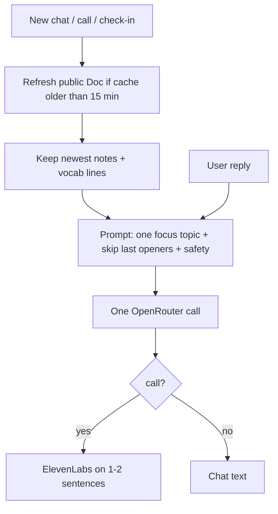

# Honza conversation improvements

**Branch:** `AI-optimization` · **implemented** (2026-09-19). Apply `supabase/migrations/0006_engine_focus.sql` if a new environment does not have the columns yet (live Hey Honza already updated).

The product job: **complement the human teacher**. Honza practices *their* words and *your* topics. He does not invent a syllabus.

## What shipped

1. **Live public Google Doc** — refetch on chat/call/check-in when the snapshot is older than 15 minutes. Failed fetch keeps the last copy.
2. **Newest notes, not the intro** — tail + vocab-looking lines. Prompt: practice these words; do not invent a syllabus.
3. **One focus topic per session** — rotated from your chips; last 3–5 skipped. Same topic until you start a new chat/call/check-in.
4. **Last 3 opening questions remembered** — so he cannot ask “co jsi jedl?” every time.
5. **Steer back** — short reply, then a natural return to the session topic.
6. **Safety refuse** — 18+, sexual abuse, harm, terrorism, racism/hate. *“This is not a topic I will talk about. Let’s change the topic.”* (Czech equivalent in Czech.)
7. **Cost** — still one model call per turn. Thread capped at 12 turns. Doc is not fetched every sentence.

Private Docs still need OAuth (out of scope).
